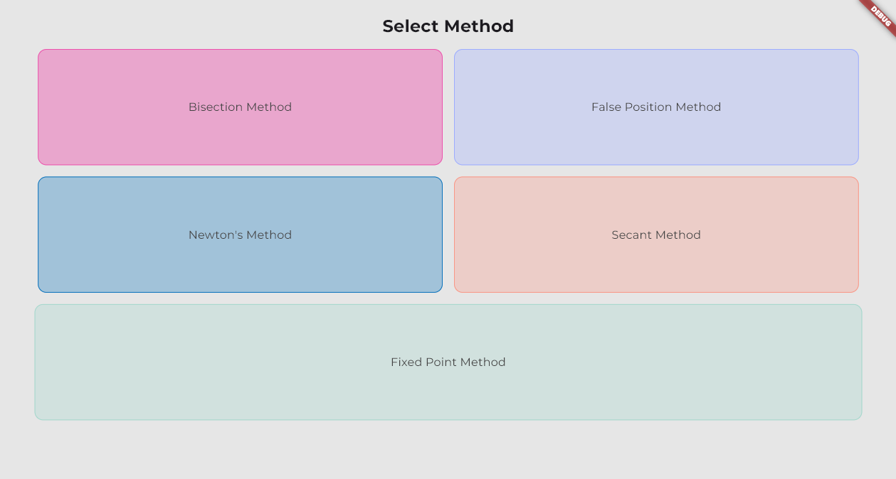

# 📱 Root Finder App

**Year Developed**: 2022  
**Course**: Numerical Methods  
**Built With**: [Flutter](https://flutter.dev)  

---

## ✨ Overview

This project was created as an assignment for the **Numerical Methods** course, combining theoretical knowledge of root-finding methods with hands-on development using **Flutter**. As my first real Flutter application, it served as both a learning experience and a practical tool for solving numerical equations.

The app provides a simple, text-based interface to compute results for various root-finding methods. It is open to students, educators, or anyone interested in numerical methods.  

---

## 🧮 Features

- Implements the following root-finding methods:
  - **Newton-Raphson**
  - **Secant Method**
  - **Bisection Method**
  - **False Position Method**
  - **Fixed Point Iteration**
- Clean and minimalistic design.
- Provides step-by-step, text-based results.
- Lightweight APK available for quick deployment.

---

## 🚀 How to Run

### Using the APK
1. Download the APK file from the [Releases](#) section of this repository. *(Link the APK if possible)*  
2. Install the APK on your Android device. *(Make sure to enable installation from unknown sources.)*  
3. Launch the app and start solving equations!  

### From Source Code
#### Prerequisites
- Install [Flutter SDK](https://flutter.dev/docs/get-started/install).  
- Set up an emulator or connect a physical Android device.  

#### Steps
1. Clone the repository:
   ```bash
   git clone https://github.com/paularezk3/root-finder-app.git
   cd root-finder-app
   ```
2. Install dependencies:
   ```bash
   flutter pub get
   ```
3. Build the APK:
   ```bash
   flutter build apk
   ```
4. Install the APK on your Android device and enjoy!

## 📸 Screenshots

Here are some screenshots showcasing the app's interface:  

  
*Main menu with available methods.*   


---

## 🛠️ Future Enhancements

While this project fulfilled its assignment requirements, future improvements could include:  
- Adding more numerical methods for root-finding.  
- Enhancing UI/UX with dynamic graphs and visualization.  
- Supporting larger datasets for extended calculations.  

---

## 🙌 Acknowledgments

- **Flutter Community**: for excellent documentation and resources.  

---

## 📄 License

This project is open-source and licensed under the [MIT License](LICENSE). Feel free to use and modify it as needed!  
